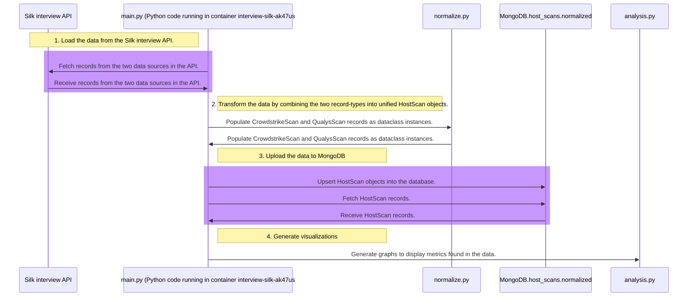
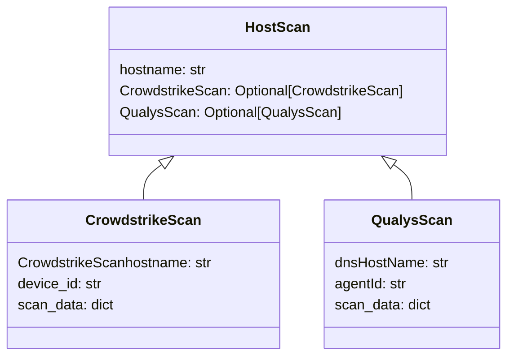

# Silk/Armis interview 2024

## Overview

This is an ETL pipeline developed as part of Silk's interview technical challenge in June 2024.
It is a sophisticated integration that allows for additional SaaS apps to be integrated later.
See also the [project instructions](./project_instructions/instructions.md).

### System diagram


### Data structure:



### Example data visualizations:
#### The majority of the hosts in our environment are Amazon Linux, no other Linux distros found:

#### From the small sample of ~8 hosts, it appears that all of them were first seen more than 30 days ago:

#### Lots of vulnerabilities found, so lets try to find the top 20 hits:


## How to deploy
1. `cd` to the repository directory.
2. Set your API key by pasting your API key into this one-liner's prompt:
    ```shell
    read -s -p "Paste the value for silk_api_token, then hit ENTER: " silk_api_token && export silk_api_token="$silk_api_token" 
    ```
3. Download the necessary containers and Python packages:
    ```shell
    docker pull mongodb mongoku ;
    pip install -r "./src/requirements.txt" ;
    ```
4. Build the Python container:
    ```shell
   docker build --tag interview-silk-ak47us/interview-silk-ak47us .
   ```
5. Bring the implementation up:
    ```shell
     docker-compose down -v --remove-orphans; docker-compose up --build -d ;
    ```
6. Access the [Mongoku database UI](http://localhost:3100/servers/mongodb/databases/host_scans/collections/normalized) 
to verify that data has been loaded into the `normalized` collection.
7. If you want to regenerate the visualizations, you can run the unit test in `analysis.py`.

## Helpful commands
Shut the implementation down:
```shell
docker-compose down -v --remove-orphans
```
Reset the implementation:
```shell
 docker-compose down -v --remove-orphans; docker-compose up --build -d;
```
Check the Python integration:
```shell
docker logs interview-silk-ak47us
```

## Extra notes:
<details>
<summary>Silk API</summary>

- During development, the interview API was limited to like less than 10 hosts, 
hence the low `limit` value on the silk API client.
- The two different data sources are under the same Python API client because they share authentication parameters and query behavior.
- The Silk API does not appear to have any headers that help pagination.
</details>

<details>
<summary>MongoDB architecture</summary>

- An investigation may want to look through the raw data as well, which is why I kept the entire data structure from each scan source.
- [Synthetic data](https://cookbook.openai.com/examples/sdg1) could have been created to test the bulk_write() performance because the interview API was limited to a miniscule amount of scan data.
- If there was more time given for optimization, [MongoDB Motor](https://www.mongodb.com/docs/drivers/motor/) could have been used for Asynch MongoDB operations:
- There may be a business case to directly combine the data from both scan types and group the key-value pairs by subject (e.g., operating system details).
  - That might be outside the scope of this exercise.
  - They were kept separate for this situation because it helps you know what vendor documentation to check for field details.
- To aid unit testing, MongoDB functions could have been fully mocked out with [mongomock](https://github.com/mongomock/mongomock).
- [MongoDB Compass](https://www.mongodb.com/try/download/compass) was very helpful.
- The "hostname" field could be optimized with a unique index: https://www.mongodb.com/docs/manual/core/index-unique/
</details>

<details>
<summary>Python optimizations</summary>

- Dataclass was used instead of dict because 
    - Dataclass: Attribute access in a dataclass is faster because attributes are accessed via the object's __dict__ (which is a fixed-size array) rather than through a hash lookup as in dictionaries.
    - Dataclass: Provides better type safety and can be used with type hints, which improves code readability and helps catch errors during development. IDEs can provide better autocompletion and static analysis.
    - Dataclass: Makes the code more readable by explicitly defining the structure of the data. This self-documenting feature makes it easier to understand and maintain. 
    - Dataclass can be up to 15x faster to access elements.
</details>
