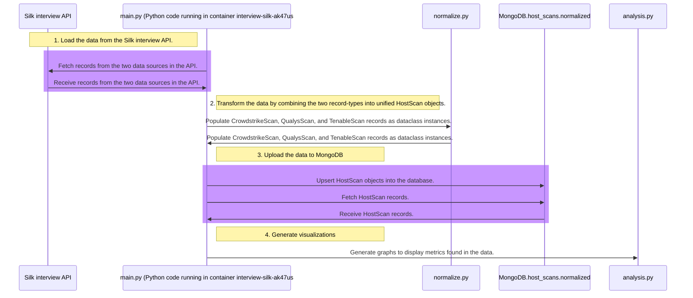
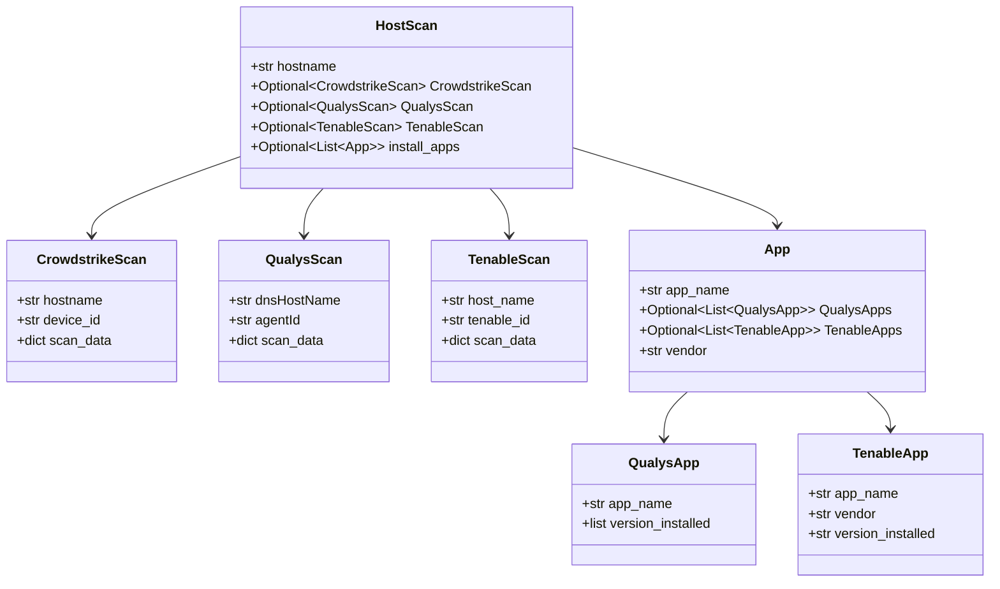
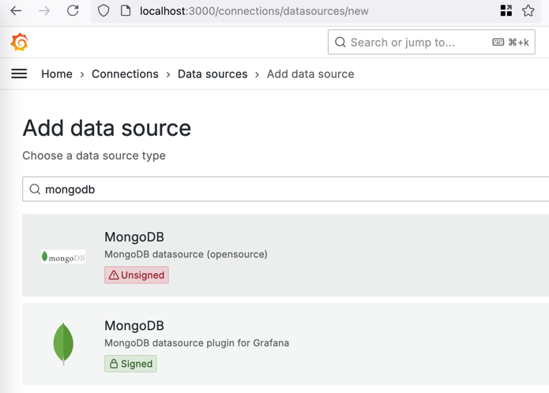
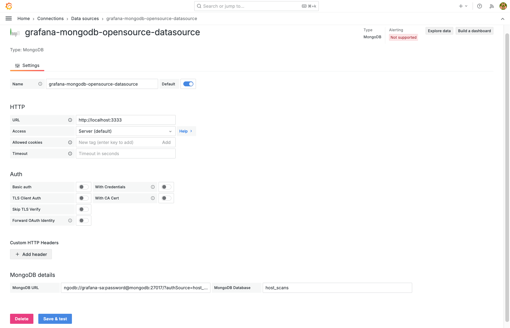

# Silk/Armis interview 2024


## Overview
This is an ETL pipeline developed as part of Silk's interview technical challenge in June 2024.
The pipeline aggregates security data from three sources: Crowdstrike, Qualys, and Tenable.
The project is built on Grafana, MongoDB, and Python.
It is a sophisticated program that allows for additional SaaS apps to be integrated later.
See [project instructions](./project_instructions/instructions.md) for interview specifications.


### Technical interview #1
After passing the take-home assignment, I was called in for a technical interview. They asked me to add add an additional integration to the project, Tenable. I implemented a new API-extract step and integrated the Tenable data into the existing HostScans schema.


### Technical interview #2
I was called in for an additional technical interview, where I was asked to add an aggregation step to the data pipeline to compile all installed applications on a host using the following instructions:
```
You should extract software names from Tenable / Qualys (not crowdstrike)
You will create a data model (Software name, vendor, version)
You will need to properly normalize the software name into the model and deal with partial data
Parse CPE from Tenable
Simple normalization from Qualys
Save the software names into a seperate mongo collection


Update the normalized host asset to include a list of installed software
Make sure to handle matching software names due to slight differences in names / versions *Keep a lookup table for when apps change names across versions*
You’ll need a better normalization or fuzzy matching
(Potential) Write deduping logic for installed software from the source
(Potential) Aggregate this data in a different report
```


### System diagram



### Data structure:



### Sample data visualizations using Pandas and Matplotlib:
#### The majority of the hosts in our environment are Amazon Linux, no other Linux distros found:

#### From the small sample of ~8 hosts, it appears that all of them were first seen more than 30 days ago:

#### Lots of vulnerabilities found, so lets try to find the top 20 hits:


## How to deploy
1. `cd` to the repository directory.
2. Set your Silk Interview API key by pasting your API key into this one-liner's prompt:
    ```shell
    read -s -p "Paste the value for silk_api_token, then hit ENTER: " silk_api_token && export silk_api_token="$silk_api_token" 
    ```
3. Download the necessary containers and Python packages:
    ```shell
    docker pull mongodb mongoku ;
    pip install -r "./src/requirements.txt" ;
    ```
4. Build the Python container:
    ```shell
    docker build --tag interview-silk-ak47us/interview-silk-ak47us .
    ```
5. Bring Grafana and MongoDB up and run 1 ETL job:
    ```shell
    docker-compose up --build -d ;
    ```
6. Sign in to the [Grafana UI](http://localhost:3000) using the credentials from [the MongoDB service account setup](db/mongo-init.js).
7. Navigate to the [Grafana datasources](http://localhost:3000/connections/datasources/new).
8. Search for `MongoDB` and click the _Unsigned_ opensource source-type:
    
9. Configure the MongoDB connection like this:
    
10. Apply the Grafana dashboard [configuration file](grafana/dashboard.json) by clicking the _New>Import_ button in [Grafana](http://localhost:3000/dashboards).
11. To verify that data has been loaded into MongoDB, you can load the dashboard [here](http://localhost:3000/dashboards) or use [Compass](https://www.mongodb.com/products/tools/compass).
12. If you want to generate the offline visualizations, you can run the unit test in `./src/analysis.py`.

## Helpful commands
Shut the implementation down:
```shell
docker-compose down -v --remove-orphans
```
Reset the implementation:
```shell
 docker-compose down -v --remove-orphans; docker-compose up --build -d;
```
Check the Python integration:
```shell
docker logs interview-silk-ak47us
```

## Extra notes:
<details>
<summary>Silk API</summary>

- During development, the interview API was limited to like less than 10 hosts, 
hence the low `limit` value on the silk API client.
- The two different data sources are under the same Python API client because they share authentication parameters and query behavior.
- The Silk API does not appear to have any headers that help pagination.
</details>

<details>
<summary>MongoDB architecture</summary>

- An investigation may want to look through the raw data as well, which is why I kept the entire data structure from each scan source.
- [Synthetic data](https://cookbook.openai.com/examples/sdg1) could have been created to test the bulk_write() performance because the interview API was limited to a miniscule amount of scan data.
- If there was more time given for optimization, [MongoDB Motor](https://www.mongodb.com/docs/drivers/motor/) could have been used for Asynch MongoDB operations:
- There may be a business case to directly combine the data from both scan types and group the key-value pairs by subject (e.g., operating system details).
  - That might be outside the scope of this exercise.
  - They were kept separate for this situation because it helps you know what vendor documentation to check for field details.
- To aid unit testing, MongoDB functions could have been fully mocked out with [mongomock](https://github.com/mongomock/mongomock).
- [MongoDB Compass](https://www.mongodb.com/try/download/compass) was very helpful.
- The "hostname" field could be optimized with a unique index: https://www.mongodb.com/docs/manual/core/index-unique/
</details>

<details>
<summary>Python optimizations</summary>

- Dataclass was used instead of dict because 
    - Dataclass: Attribute access in a dataclass is faster because attributes are accessed via the object's __dict__ (which is a fixed-size array) rather than through a hash lookup as in dictionaries.
    - Dataclass: Provides better type safety and can be used with type hints, which improves code readability and helps catch errors during development. IDEs can provide better autocompletion and static analysis.
    - Dataclass: Makes the code more readable by explicitly defining the structure of the data. This self-documenting feature makes it easier to understand and maintain. 
    - Dataclass can be up to 15x faster to access elements.
- One could re-implement the API client to kick off a batch of asynchronous HTTP calls, based on pagination parameters. This would save lots of time spent waiting for each request.
- The code could also be re-implemented in Cython or Jython, allowing for faster compiled code when running the analysis and graph generation.
- For graphing, Pandas can split the data in MongoDB into chunks, which helps for cases where the data is larger than local system memory can allow.
- The data could also be offloaded to Redis during calculation if it becomes too big.
- Apache Airflow should also be implemented for improved code readability and to be able to use the UI to see scheduled syncs. Also increases collaboration and transparency.
</details>
